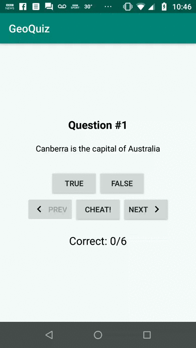

## QuizApp2

A Quiz Application taken from The Big Nerd Ranch: Android Programming 3rd Edition, but with a few modications to the code to improve the app's performance and it's activity layouts.

This app illustrates how data is saved through screen rotation, and how data is tranferred from one activity to the other seemlessly.

Also, this app has French traslations to it as well, in the case where the user has their phone's language set to French.
Everything other than the questions have French translations. 

### N.B)

I'm currently in the process of trying to improve the app even more by adding in some more functionalities, as well as by touching up some issues with screen rotation. Also, looking to add translations to the questions themselves. 

## App In Use

